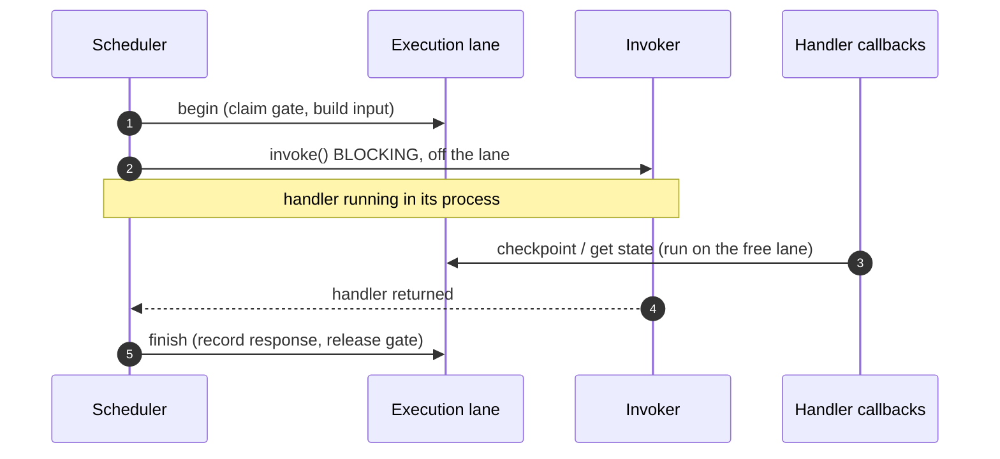
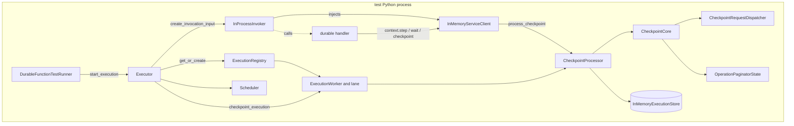
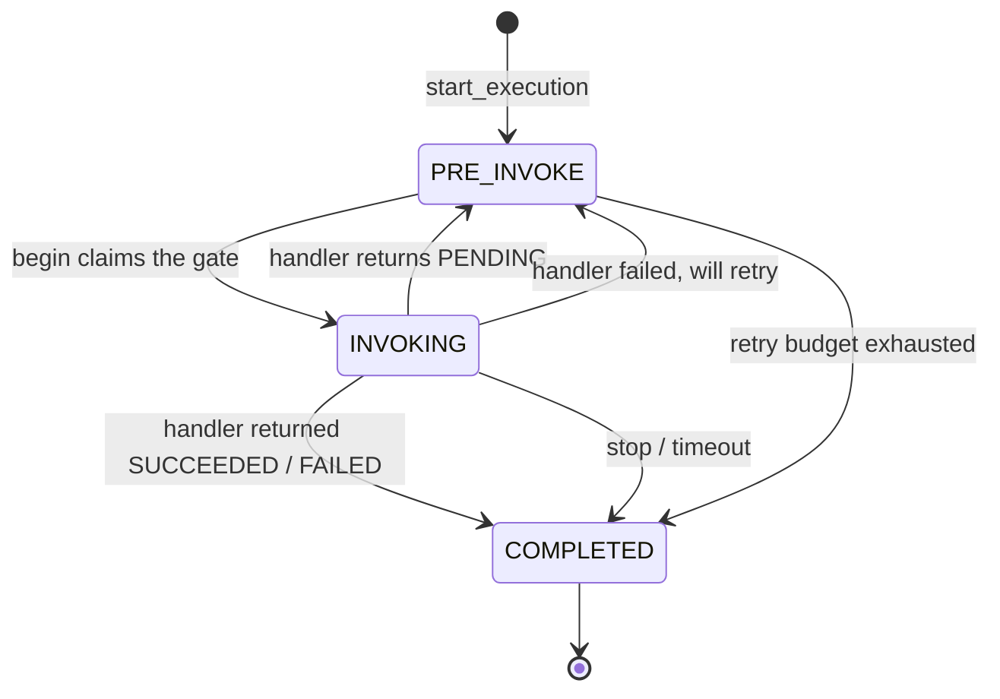
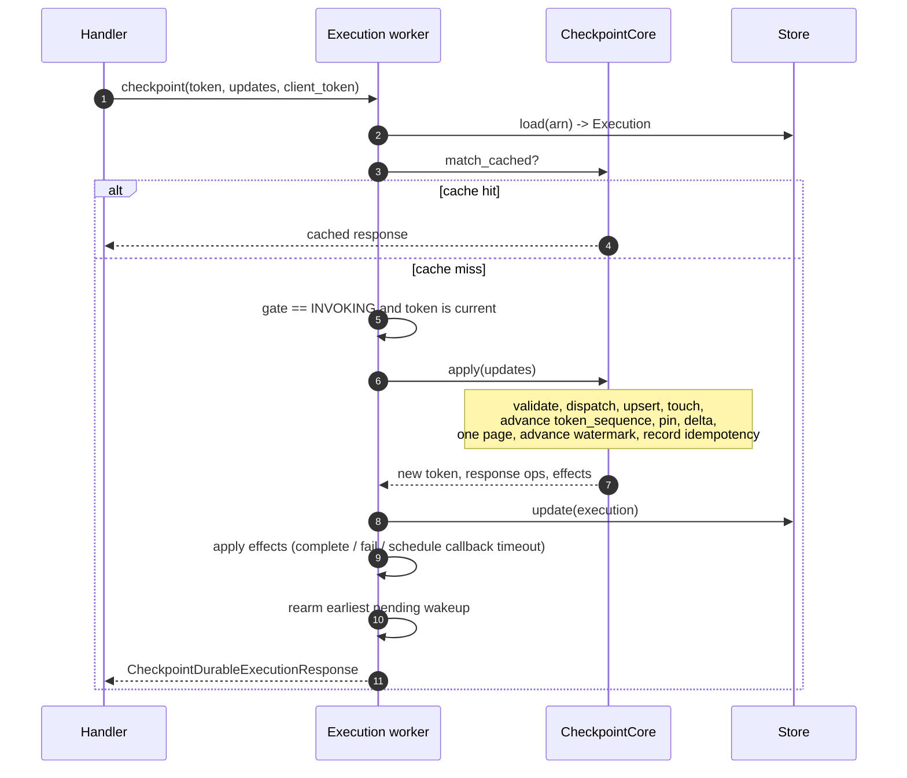
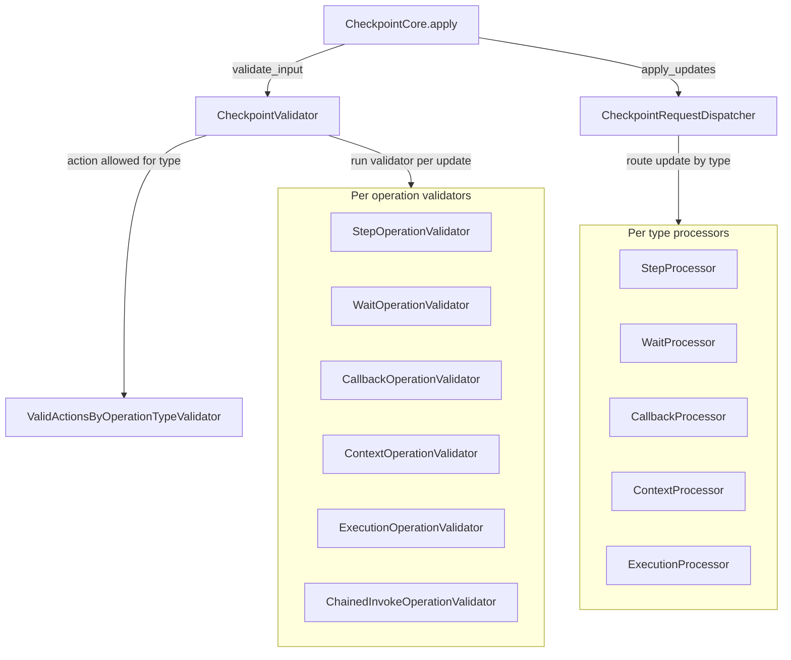

# Architecture

This is the on ramp for developers working on the testing framework
itself. It describes how the framework is put together and how to find
your way around the code.

If you are writing tests for your own durable functions, start at the
[README quickstart](../README.md) instead.

## What this framework is

The framework runs durable function code locally. It serves the durable
execution service contract that the function's SDK calls back into. That
contract covers checkpoint, get state, and callbacks. A test can drive a
durable function to completion with no deployed service. The observable
behaviour stays the same as production.

Three runners cover different needs.

- `DurableFunctionTestRunner` runs the durable function in the test's
  own interpreter. It is fast and deterministic. It uses no network. It
  is the default for unit and integration tests.
- `WebRunner` serves the same contract over HTTP. A function running in
  a separate Lambda process can reach it over the wire. One example is
  `sam local start-lambda`. Use it to exercise the real Lambda runtime
  and HTTP client path locally.
- `DurableFunctionCloudTestRunner` invokes a function already deployed
  to AWS and polls for completion. It is a thin client over the real
  service. It is not a local implementation.

This doc covers the first two. They share nearly all of their internals.
The cloud runner only drives a deployed function. It is described under
[Runners at a glance](#runners-at-a-glance).

## Core building blocks

### `Execution` in `execution.py`

This is the persistent state of one durable execution. It holds the
operation list, the counters, the delivery watermark, and the
idempotency slot. Each store serializes it through `to_json_dict` and
`from_json_dict`. The stores are `InMemoryExecutionStore`,
`SQLiteExecutionStore`, and `FileSystemExecutionStore`.

Stores are local to the process and load by value. A SQLite or
Filesystem store returns a freshly deserialized `Execution` on every
`load`. So fields on an `Execution` instance cannot coordinate
concurrent callers across a load and save window. Coordination lives on
the worker instead. See below.

### The worker model

Several callers act on the same execution at once. The function makes
checkpoint and get state calls. Wait and retry timers fire. Callbacks
arrive. A stop can be requested. To keep one execution's state
consistent, all of its operations run on one worker, one at a time.

- `ExecutionRegistry` in `worker/registry.py` owns one `ExecutionWorker`
  per execution ARN. It creates a worker the first time an execution is
  acted on. It hands the same worker out for every later operation. It
  drops the worker once the execution completes. Lookups are guarded, so
  concurrent callers always resolve to the same worker.
- `ExecutionWorker` in `worker/execution_worker.py` runs every operation
  for one execution on its lane. It carries the invocation state from
  each task into the next. It tears itself down when the execution
  reaches a terminal status.
- `SerialTaskLane` in `worker/lane.py` is a FIFO queue with one consumer
  thread. `submit(fn)` returns a `Future`. The caller may block on it or
  ignore it. Tasks run in submit order with no overlap. An exception on
  one task is captured on its future and does not stop the lane.
  Independent lanes run in parallel.
- `ExecutionTask` and `TaskOutcome` in `worker/task.py` are the contract
  for work run on a worker. A task runs with exclusive access to its
  execution for the duration of `execute`. So it may load and mutate the
  execution with no further synchronization. It returns the next
  invocation state and the value to deliver to the caller.

Two task shapes cover everything. They live in
`worker/checkpoint_tasks.py`.

- `CheckpointTask` and `GetStateTask` apply a checkpoint or read state
  through `CheckpointProcessor`.
- `CallableTask` runs an arbitrary callable on the lane. It lets the
  `Executor` serialize an existing method on the execution's worker
  without restating it as a task.

After any task, the worker carries `COMPLETED` forward once the
execution is terminal. That triggers teardown. Otherwise it keeps the
status the task left.

### `InvocationState` in `worker/status.py`

This is an enum with three values. They are `PRE_INVOKE`, `INVOKING`,
and `COMPLETED`. It lives on the worker. It gates handler invocation and
checkpoint validity. It is never persisted. A persisted `INVOKING` could
be read back after a crash as "a handler is running" when none is. That
would strand the execution behind the gate. An absent worker means
`PRE_INVOKE`.

### `CheckpointRequestDispatcher` in `checkpoint/transformer.py`

This applies a batch of `OperationUpdate` values to an `Execution` in
place. For each accepted update it dispatches to a processor for that
operation type. The types are step, wait, callback, context, and
execution. It upserts the resulting `Operation`. It records the payload
size. It touches the operation. It returns the lifecycle effects implied
by the batch. See below. It does not build the response.

### `CheckpointCore` in `checkpoint/core.py`

This is the one checkpoint write transaction shared by both entry
points. Its `apply` advances `token_sequence` once. It returns one page
of the operations the handler has not yet seen. It advances the delivery
watermark only for what it returns. It records the idempotency entry so
a retried call can replay the same bytes. Its `match_cached` returns the
cached record for a retried pair of `client_token` and
`checkpoint_token`. The caller owns the gate. The caller owns
persistence. The caller applies the returned effects.

### Effects in `checkpoint/effects.py`

Applying a batch can imply actions beyond the state change. The
execution completed, which is `Completed`. The execution failed, which
is `Failed`. A callback was created and needs a timeout, which is
`CallbackCreated`. These are returned as data. The caller applies them
after the write finishes. No follow up action runs in the middle of a
write.

### `OperationPaginatorState` in `execution.py`

This is a pinned snapshot of an execution's operation list at one
`token_sequence`. It serves every read the handler sees. It gives a page
bounded by bytes for invocation input and `GetDurableExecutionState`. It
gives the delta of operations past `handler_seen_seq` for a checkpoint
response. It advances the delivery watermark forward. Pinning the
sequence at construction means a page or delta sees one consistent
snapshot even while the execution is mutated. It is frozen and cheap.
Its lifetime is one call.

## Concurrency model

Every operation on an execution runs as a task on that execution's
worker lane.

- Operations for the same execution run one at a time, in submit order.
  Nothing overlaps. No caller observes or writes half applied state.
- Operations for different executions run on different lanes, in
  parallel.

The public methods on `Executor` resolve the execution's worker and
submit the work, then block on the returned future. Those methods are
`checkpoint_execution`, `get_execution_state`, and the callback and stop
entry points. Timer and callback callbacks submit the same way but do
not block.

### Invocation runs off the lane

When a handler runs in a separate process, it calls back over HTTP to
checkpoint and read state. Those calls must run on the execution's lane.
So the blocking handler invocation must not occupy the lane. Otherwise
the handler would wait on a lane it needs in order to make progress.

`_invoke_handler` splits the invocation into three steps.

1. Begin. A task on the lane claims the gate from `PRE_INVOKE` to
   `INVOKING` and builds the invocation input.
2. Invoke. The blocking call to the function runs off the lane, bounded
   by the invocation timeout. While it blocks, the handler's checkpoint
   and get state tasks run on the now free lane.
3. Finish. A task on the lane records the response and releases the
   gate. It moves `PENDING` to `PRE_INVOKE`, or a terminal result to
   `COMPLETED`.



### Completion teardown

When a task leaves the execution terminal, the worker removes itself
from the registry and stops its lane without waiting. It runs on that
lane, so a join would wait on the current thread. The stop takes effect
at once. Any later submit for a completed execution is rejected. It does
not run against torn down state. A late gate write cannot bring a removed
worker back.

## The two counters

`Execution` holds two counters that only ever increase. They do
different jobs. Confusing them is the most common source of mistakes.

### `seq_counter` is the internal event counter

It increases every time operation state changes. That covers every
update applied in a checkpoint, every wait timer fire, every step retry
made ready, every callback resolution, and every terminal transition. It
is applied through `Execution.touch_operation(op_id)`. That call also
records `operation_last_touched_seq[op_id] = seq_counter`.

### `token_sequence` is the checkpoint response version

It increases once per accepted non idempotent checkpoint call. The SDK
validates against it when it presents a checkpoint token. The question
is whether this token's sequence is the current one. It is advanced only
by `Execution.advance_token_sequence()`. That runs exactly once inside
the checkpoint write transaction.

### Rules of thumb

- Applying a state change wants `touch_operation`.
- Accepting a checkpoint call wants `advance_token_sequence`. Call it
  once, whatever the number of updates the call carried.
- Idempotent replays advance neither.
- Pure reads advance neither.

## The watermark and delta

`Execution.handler_seen_seq` records the highest `seq_counter` the
handler has been told about. The handler learns of operations through
`InitialExecutionState` on an invocation, or through the `operations`
list in a checkpoint response. The delta for the next response is the
operations whose `operation_last_touched_seq` is greater than
`handler_seen_seq`.

The watermark advances only when a checkpoint response is built. It never
advances when invocation input is built. That is what makes retries
correct. A failed invocation never moves the watermark. So the retry
delivers the same state again.

```
      seq_counter    handler_seen_seq    delta next checkpoint
      .              .                   .
      0              0                   (none, just started)
      touch A = 1    0                   {A}
      touch B = 2    0                   {A, B}
      checkpoint     2                   (empty, all delivered)
      touch C = 3    2                   {C}
      retry op C = 4 2                   {C} (touched again)
      checkpoint     4                   (empty)
```

## Component diagram

This is the in process shape used by `DurableFunctionTestRunner`. The
`WebRunner` shape is the same except `InProcessInvoker` is replaced by
`LambdaInvoker` plus a Lambda process reaching back over HTTP.



Two points stand out.

- There are two checkpoint entry points. `Executor.checkpoint_execution`
  is used by the HTTP route. `CheckpointProcessor.process_checkpoint` is
  used by `InMemoryServiceClient` in process. Both run on the
  execution's worker and share `CheckpointCore`, so behaviour matches.
- The scheduler is async. Its event loop runs on a background thread.
  `call_later` returns a `Future`.

## Invocation state machine

The gate on each worker governs when a handler can be invoked and when a
checkpoint call is valid.



The gate enforces a few rules.

- At most one handler invocation is in flight per execution. A second
  invoke attempt that finds `INVOKING` records that a re invoke is needed
  and returns. It does not start a new handler.
- `checkpoint_execution` and `get_execution_state` are valid only while
  the gate is `INVOKING`. Outside it they reject with
  `InvalidParameterValueException`. This rejects stale calls from a
  handler process that died and returned after teardown.
- Retries re enter `PRE_INVOKE` then `INVOKING` through the same path. So
  every rule still applies.

## Checkpoint flow

A checkpoint call runs as a task on the execution's worker. It goes
through a fixed pipeline. The logic is shared by both entry points
through `CheckpointCore`.



A few points are worth calling out.

1. Idempotency is checked before the gate and the token. A caller that
   retries a call that already succeeded gets the cached response. That
   holds even if the execution has moved on.
2. The checkpoint response is one page. If the delta is larger than
   `max_invocation_page_bytes`, it is cut to what fits. The watermark
   advances only for the returned operations. The rest comes back on the
   next checkpoint call.
3. Effects are applied after the write. Completion, failure, and callback
   timeout scheduling submit follow up work onto the execution's lane. A
   running lane task cannot re enter the lane. So they run once the write
   returns.
4. A call with no updates still advances `token_sequence` and can return
   operations. An async completion that fired between invocations shows
   up as a delta even when `updates` is empty. One example is a wait
   timer that succeeded.

### Operation processors and validators

The write transaction validates a batch and then applies it.
`CheckpointValidator` runs first. For each update it checks that the
action is allowed for the operation type through
`ValidActionsByOperationTypeValidator`, then runs the validator for that
type. `CheckpointRequestDispatcher` then routes each update to the
processor for its type, which produces the new operation. CHAINED_INVOKE
has a validator but no processor, which is the unimplemented feature.



## Invocation lifecycle

`_invoke_execution(arn)` is the one scheduling entry point. Every trigger
routes through it. The triggers are the initial start, a re arm after a
checkpoint, a wait timer fire, a step retry fire, and a callback arrival.
Routing through one entry point means the single invocation rule and the
retry budget cannot be bypassed.

### Retry budget

A handler exception or an output validation failure increases the
execution's `consecutive_failed_invocation_attempts`. At
`MAX_CONSECUTIVE_FAILED_ATTEMPTS` the execution is failed with the last
observed error. Below that, a retry is scheduled through
`_invoke_execution` after `RETRY_BACKOFF_SECONDS`. Any clean invocation
resets the counter. A clean invocation is one that succeeded or returned
PENDING. So a transient failure followed by a success does not count
against future budget.

### Invocation timeout

`execution_timeout` and `invocation_timeout` are set on the runner
constructor and CLI. The invocation timeout bounds one handler call. It
models the function's configured timeout. A call that runs past it is
abandoned. The in flight step stays `STARTED` because no checkpoint was
sent. The execution is invoked again. So on the next invocation the SDK
observes the interrupted step. The execution timeout fails the whole
execution once its deadline passes.

### Earliest pending scheduler

When a handler returns `PENDING` it has usually declared async
operations. Each has a future moment to wake on.

- `wait.scheduled_end_timestamp` for waits in `STARTED`.
- `step.next_attempt_timestamp` for steps in `PENDING`.
- Callbacks keep their own timers.

`_schedule_earliest_pending(arn)` arms one wake up at the minimum of
those moments. When it fires, it completes every operation whose moment
has passed. Each completion touches its operation. It then routes through
`_invoke_execution` to enter the handler again. It is armed again after a
checkpoint commits, after a `PENDING` invocation, and after it fires. The
cancel then arm sequence runs under `_pending_wakeup_lock`. So concurrent
callers cannot leave an orphan future in the `_pending_wakeup` map.

## Pagination

Three reads the handler sees all use `OperationPaginatorState`. The
caller's job differs across them.

| Read site                  | Pages? | Marker                      |
|----------------------------|--------|-----------------------------|
| `InitialExecutionState`    | Yes    | Real marker if state splits |
| `GetDurableExecutionState` | Yes    | Real marker round trip      |
| Checkpoint response delta  | No     | Always `None`               |

### Marker format

Markers are opaque to the SDK. They are encoded as `"seq:idx"`. `seq` is
the pinned `token_sequence`. `idx` is the next index into the snapshot. A
marker raises `InvalidParameterValueException` in three cases. Its
sequence does not match the pinned snapshot. Its index is out of range.
It does not parse. So a marker is valid only while the execution is at
the same `token_sequence`. Once a checkpoint advances the counter,
outstanding markers become invalid. A marker can never page an old
snapshot.

### Why the checkpoint response is not paged

`GetDurableExecutionState` returns one page of a full snapshot. Its
markers index into that snapshot. A checkpoint response returns a delta.
Its markers could not round trip cleanly into `get_execution_state`. So a
delta larger than the byte cap is cut to one page. The watermark advances
only for the returned operations. The rest returns on the next checkpoint
call.

### `max_invocation_page_bytes`

This is set on `DurableFunctionTestRunner.__init__` and `WebRunnerConfig`.
Otherwise it is `DEFAULT_MAX_INVOCATION_PAGE_BYTES`. Every read that uses
a paginator honours this cap. A test that wants to exercise a split
across pages passes a small value.

## Where to look in the code

| I want to understand                          | Start here                                                                  |
|-----------------------------------------------|-----------------------------------------------------------------------------|
| What gets persisted and serialized            | `execution.py`, `Execution.to_json_dict` and `from_json_dict`               |
| How operations serialize per execution        | `worker/registry.py`, `worker/execution_worker.py`, `worker/lane.py`        |
| The checkpoint write transaction              | `checkpoint/core.py`, `CheckpointCore`                                      |
| The HTTP checkpoint entry point               | `executor.py`, `Executor.checkpoint_execution`                              |
| The in process checkpoint entry point         | `checkpoint/processor.py`, `CheckpointProcessor.process_checkpoint`         |
| How an `OperationUpdate` becomes an `Operation` | `checkpoint/transformer.py`, `CheckpointRequestDispatcher`                |
| State transitions per operation type          | `checkpoint/processors/{step,wait,callback,context,execution}.py`           |
| Which updates are valid for which state       | `checkpoint/validators/valid_actions_by_operation_type.py`                  |
| The gate, the off lane invoke, the retry budget | `executor.py`, `_invoke_handler`, `_invoke_execution`, `_retry_invocation` |
| Wait and step retry timer scheduling          | `executor.py`, `_schedule_earliest_pending`, `_fire_due_and_invoke_handler` |
| Callback timeout and heartbeat timers         | `executor.py`, `_schedule_callback_timeouts`, `_on_callback_timeout`        |
| The HTTP surface used by `WebRunner`          | `web/handlers.py`, `web/routes.py`                                          |
| How tests drive a full run                    | `tests/executor_checkpoint_test.py`, `tests/executor_invariants_test.py`    |
| Worker concurrency invariants                 | `tests/worker/concurrency_test.py`, `tests/worker/lane_test.py`             |

## Runners at a glance

| Runner                           | Handler runs in              | Service client          | Invoker            | Use for                              |
|----------------------------------|------------------------------|-------------------------|--------------------|--------------------------------------|
| `DurableFunctionTestRunner`      | Same Python process as tests | `InMemoryServiceClient` | `InProcessInvoker` | Unit and integration, the default    |
| `WebRunner`                      | Lambda process, SAM CLI etc. | HTTP routes             | `LambdaInvoker`    | Integration with the Lambda runtime  |
| `DurableFunctionCloudTestRunner` | Deployed AWS Lambda          | none, calls Lambda directly | real boto3         | Smoke tests against real deployments |

## See also

- `docs/error-responses.md` for the error response format the HTTP routes
  emit.
- `CONTRIBUTING.md` for the developer workflow. It covers hatch
  environments and test commands.
